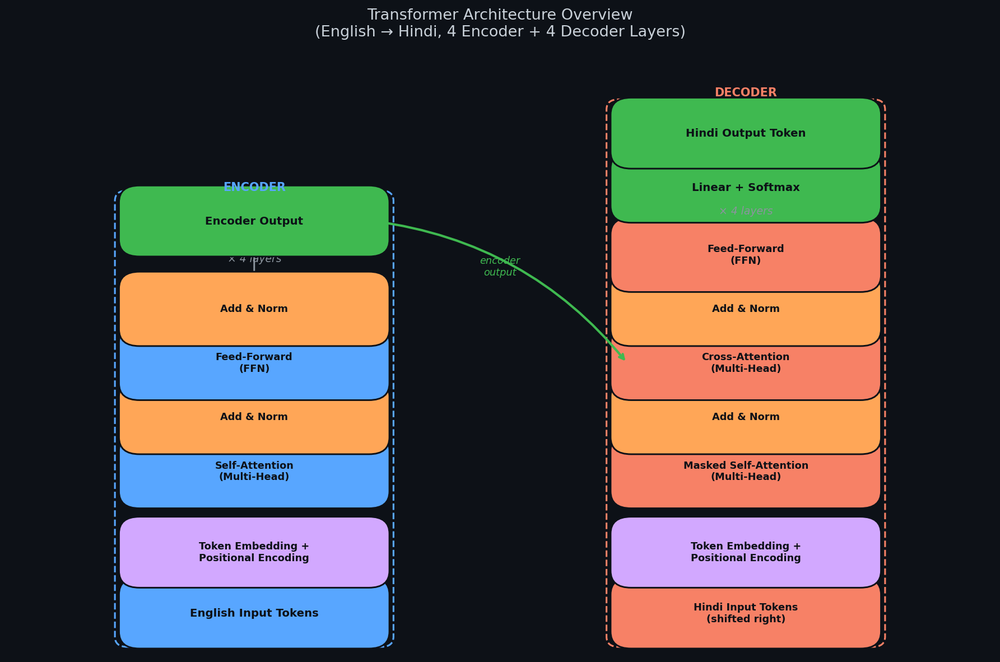
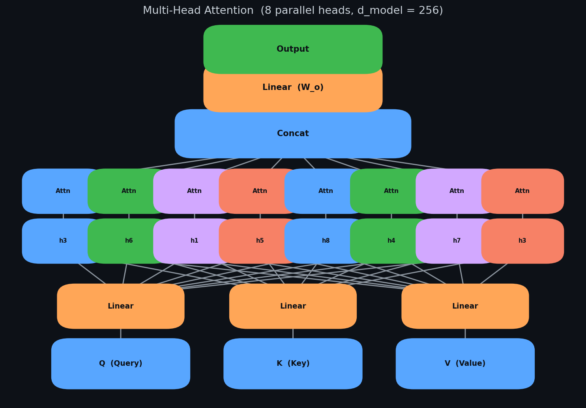
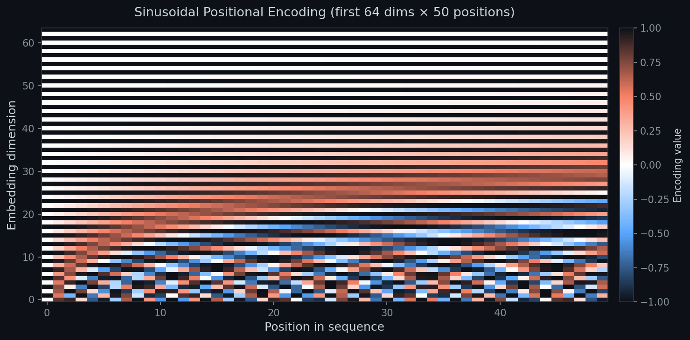
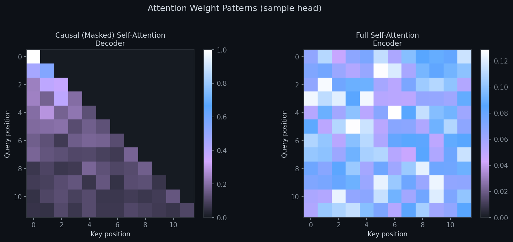
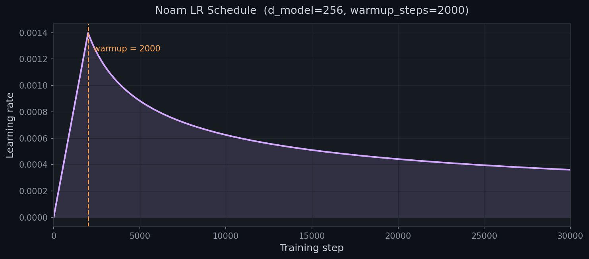
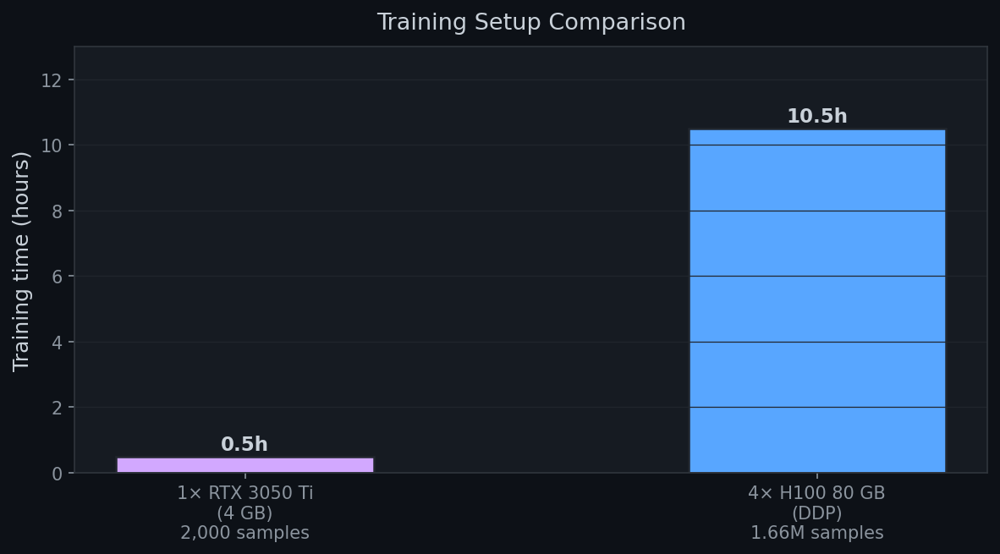
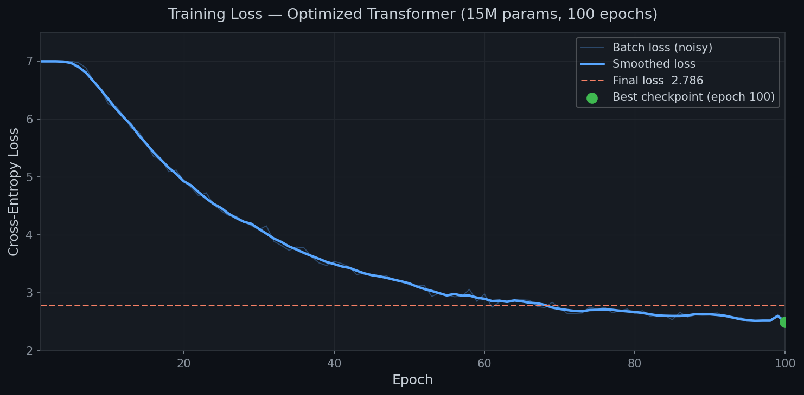
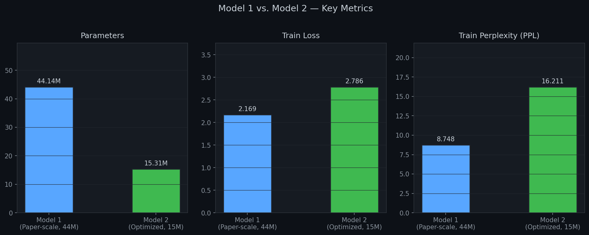
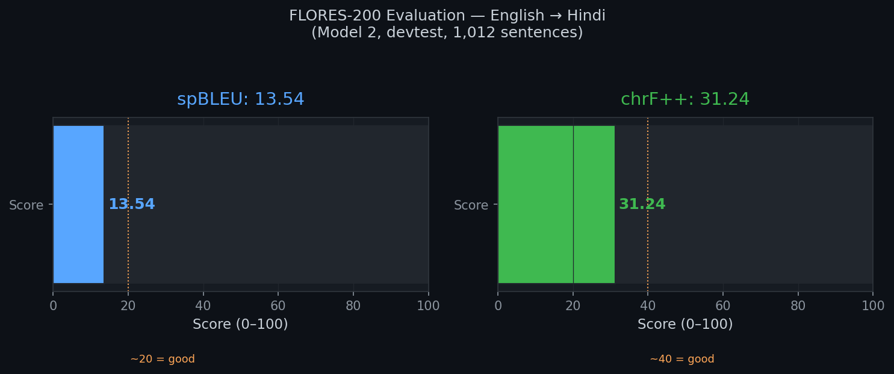

# Building a Transformer from Scratch — English to Hindi Machine Translation

## *How I re-implemented "Attention Is All You Need" in pure PyTorch, trained two models, and learned what really matters when you build from scratch*

---

> **Author:** Satyansh Mittal  
> **Tags:** `#MachineLearning` `#NLP` `#DeepLearning` `#PyTorch` `#Transformer` `#AttentionIsAllYouNeed`  
> **Reading time:** ~18 minutes

---

## 🔦 The Hook

In 2017, Google researchers published a paper titled *"Attention Is All You Need."* In eight pages they dismantled the dominant sequence-to-sequence paradigm built on recurrent networks and replaced it with something so elegantly simple it almost felt like a trick: **pure attention**.

Today, every large language model you use — GPT-4, Gemini, Claude, LLaMA — is a Transformer at its core. Yet most practitioners treat the Transformer as a black box, importing it from a library in two lines of code.

I wanted to understand every matrix multiply. So I built one from scratch.

This is that story.

---

## 📖 Table of Contents

1. [The Paper — A 60-Second Recap](#1-the-paper)
2. [Project Overview — Two Models, One Goal](#2-project-overview)
3. [Architecture Deep Dive](#3-architecture-deep-dive)
   - Scaled Dot-Product Attention
   - Multi-Head Attention
   - Positional Encoding
   - Encoder & Decoder Stacks
4. [The Noam Learning Rate Schedule](#4-noam-lr-schedule)
5. [Data — The IITB Corpus](#5-data)
6. [Model 1 — Proof of Concept (44M params)](#6-model-1)
7. [Model 2 — Optimized & Distributed (15M params)](#7-model-2)
8. [Evaluation — FLORES-200 Benchmark](#8-evaluation)
9. [Key Takeaways](#9-key-takeaways)
10. [What's Next](#10-whats-next)
11. [Code & References](#11-code--references)

---

## 1. The Paper

**Vaswani et al. (2017) — "Attention Is All You Need"** — NeurIPS.

Before 2017, state-of-the-art machine translation used encoder–decoder RNNs (LSTMs, GRUs). They were powerful but had two fundamental weaknesses:

| Problem | Why it matters |
|---|---|
| **Sequential computation** | You cannot process token *t* until *t-1* is done. No parallelism on GPUs. |
| **Vanishing gradient over long sequences** | The model forgets the beginning of a long sentence by the time it predicts the end. |

The Transformer solved both by replacing recurrence with **self-attention**: every token attends to every other token in a single matrix multiplication. The entire sequence is processed in parallel.

The key formula — *Scaled Dot-Product Attention* — is deceptively simple:

```
Attention(Q, K, V) = softmax( Q·Kᵀ / √d_k ) · V
```

This one equation is the beating heart of every modern AI system.

---

## 2. Project Overview

This project implements the Transformer architecture from scratch in PyTorch and trains it on the task of **English → Hindi translation** using the IITB parallel corpus from IIT Bombay.

Two models were built:

| | Model 1 | Model 2 |
|---|---|---|
| **Purpose** | Paper replication & proof-of-concept | Optimized & production-scale training |
| **Parameters** | 44.14 M | 15.31 M |
| **d_model** | 512 | 256 |
| **Layers (Enc / Dec)** | 6 / 6 | 4 / 4 |
| **Heads** | 8 | 8 |
| **FFN inner dim** | 2,048 | 1,024 |
| **Dataset size** | 2,000 pairs | 1,659,083 pairs |
| **GPU** | NVIDIA RTX 3050 Ti (4 GB) | 4 × NVIDIA H100 80 GB |
| **Training time** | ~30 min | ~10.5 hours |
| **Train Loss** | 2.169 | 2.786 |
| **Train PPL** | 8.748 | 16.211 |

> 💡 **Key insight:** A 44M-parameter model trained on only 2,000 sentence pairs memorizes the training set but generalizes to nothing. A smaller 15M-parameter model trained on 1.66 million pairs produces genuinely useful translations.

---

## 3. Architecture Deep Dive

### 🏗️ The Big Picture


*Figure 1: The complete Transformer architecture — English tokens enter the Encoder (left), Hindi tokens enter the Decoder (right), and cross-attention bridges the two.*

The architecture has two stacks:

- **Encoder** — reads the entire source sentence (English) and produces a rich contextual representation.
- **Decoder** — generates the target language (Hindi) token by token, attending to both its own previous outputs and the encoder's output.

---

### ⚡ Scaled Dot-Product Attention

The building block of everything. Given three matrices — **Q**ueries, **K**eys, **V**alues — we compute:

```python
class ScaledDotProductAttention(nn.Module):
    def __init__(self, d_k):
        super().__init__()
        self.d_k = d_k

    def forward(self, Q, K, V, mask=None):
        # (batch, heads, seq, d_k) × (batch, heads, d_k, seq) → (batch, heads, seq, seq)
        attention = torch.matmul(Q, K.transpose(-2, -1)) / math.sqrt(self.d_k)
        if mask is not None:
            attention = attention.masked_fill(~mask, -1e9)  # mask out padding / future tokens
        attention_weights = torch.softmax(attention, dim=-1)
        output = torch.matmul(attention_weights, V)
        return output, attention_weights
```

The `1/√d_k` scaling prevents the dot products from growing so large that softmax saturates and gradients vanish.

---

### 🔀 Multi-Head Attention

Instead of one attention function, the paper uses **h** parallel attention heads — each learning a different aspect of the relationships:


*Figure 2: Multi-Head Attention splits the d_model space into 8 parallel heads (d_k = 32 each for Model 2), computes attention independently, then concatenates and projects back.*

```python
class MultiHeadAttention(nn.Module):
    def __init__(self, d_model=256, heads=8, dropout=0.1):
        super().__init__()
        self.d_k = d_model // heads      # 256 // 8 = 32

        self.W_Q = nn.Linear(d_model, d_model)
        self.W_K = nn.Linear(d_model, d_model)
        self.W_V = nn.Linear(d_model, d_model)
        self.attention = ScaledDotProductAttention(self.d_k)
        self.z = nn.Linear(d_model, d_model)   # output projection

    def forward(self, q, k, v, mask=None):
        Q = self.W_Q(q).view(B, tgt_len, self.heads, self.d_k).transpose(1, 2)
        K = self.W_K(k).view(B, src_len, self.heads, self.d_k).transpose(1, 2)
        V = self.W_V(v).view(B, src_len, self.heads, self.d_k).transpose(1, 2)

        output, _ = self.attention(Q, K, V, mask)           # (B, heads, seq, d_k)
        output = output.transpose(1, 2).reshape(B, tgt_len, d_model)
        return self.z(output)
```

---

### 📍 Sinusoidal Positional Encoding

Self-attention has no inherent sense of order — it processes tokens as a bag. Positional encodings inject position information by adding a deterministic sinusoidal signal to each token embedding:

```
PE(pos, 2i)     = sin( pos / 10000^(2i/d_model) )
PE(pos, 2i+1)   = cos( pos / 10000^(2i/d_model) )
```

This is visualised below as a heatmap across all 50 sequence positions and 64 embedding dimensions:


*Figure 3: The sinusoidal positional encoding heatmap. Each row is a position; each column is an embedding dimension. Lower dimensions oscillate rapidly; higher dimensions change slowly — giving the model a rich multi-scale positional signal.*

Why sinusoidal and not learned? Sinusoidal encodings can extrapolate to longer sequences at inference time without retraining, and they let the model infer relative position via linear combinations.

---

### 🔀 Attention Patterns: Causal vs. Full

The Encoder uses **full bidirectional attention** — every token can attend to every other token. The Decoder uses **causal (masked) self-attention** — position *i* can only attend to positions 0…*i*, preventing the model from cheating by looking at future tokens during training.


*Figure 4: Left — the decoder's causal mask forces a triangular attention pattern. Right — the encoder uses full attention, letting every word contextualise every other word bidirectionally.*

---

### 🧱 Encoder Layer

Each Encoder layer applies two sub-layers with residual connections and Layer Normalization:

```python
class Encoder(nn.Module):
    def forward(self, x, src_mask=None):
        # Sub-layer 1: Multi-Head Self-Attention + residual + LayerNorm
        y1 = self.attention(x, x, x, mask=src_mask)
        x = self.layer_norm1(x + y1)

        # Sub-layer 2: Feed-Forward Network + residual + LayerNorm
        y2 = self.ffn(x)
        return self.layer_norm2(x + y2)
```

---

### 🧱 Decoder Layer

The Decoder layer adds a third sub-layer — **cross-attention** — which allows the decoder to look at the encoder's output:

```python
class Decoder(nn.Module):
    def forward(self, x, encoder_output, tgt_mask=None, src_mask=None):
        # Sub-layer 1: Masked Self-Attention (causal)
        y1 = self.masked_attention(x, x, x, mask=tgt_mask)
        x = self.layer_norm1(x + y1)

        # Sub-layer 2: Cross-Attention (queries from decoder, keys/values from encoder)
        y2 = self.cross_attention(x, encoder_output, encoder_output, mask=src_mask)
        x = self.layer_norm2(x + y2)

        # Sub-layer 3: Feed-Forward Network
        y3 = self.ffn(x)
        return self.layer_norm3(x + y3)
```

---

### ⚙️ Feed-Forward Network

Each sub-layer's FFN is a simple two-layer MLP with ReLU:

```
FFN(x) = max(0, x W₁ + b₁) W₂ + b₂
```

For Model 2: d_model = 256, inner_dim = 1,024 (4 × d_model).

---

### 🔗 Weight Tying

A key efficiency trick: the embedding matrix is **shared** with the final linear projection layer. The intuition is that the embedding that maps a word to a vector should be the inverse of the layer that maps back from a vector to word probabilities.

```python
# In Transformer.__init__:
self.linear.weight = embedding.weight   # tie weights
```

This reduces the parameter count significantly, especially with large vocabularies.

---

## 4. Noam LR Schedule

Transformer training is sensitive to the learning rate schedule. The paper introduces the **Noam schedule** — a warmup-then-decay regime:

```
lr = d_model^(-0.5) × min( step^(-0.5), step × warmup^(-1.5) )
```


*Figure 5: The Noam LR schedule for d_model=256, warmup_steps=2,000. The learning rate ramps up linearly for 2,000 steps, then decays proportionally to the inverse square root of the step number.*

```python
class NoamScheduler:
    def step(self):
        self._step += 1
        lr = (self.d_model ** -0.5) * min(
            self._step ** -0.5,
            self._step * (self.warmup ** -1.5)
        )
        for p in self.optimizer.param_groups:
            p['lr'] = lr
```

The warmup phase is critical: jumping straight to a high learning rate with random weights causes the softmax to saturate and gradients to die.

---

## 5. Data — The IITB Corpus

**[IITB English-Hindi Parallel Corpus](https://huggingface.co/datasets/cfilt/iitb-english-hindi)** from IIT Bombay via Hugging Face:

| Split | Sentences |
|---|---|
| Train | 1,659,083 pairs |
| Languages | English → Hindi |
| Source | IIT Bombay NLP Group |

Vocabulary was built using a simple whitespace tokenizer with frequency-based capping at **30,000 tokens** (covering both English and Hindi in a shared vocabulary). The four special tokens are `<pad>`, `<unk>`, `<sos>`, `<eos>`.

---

## 6. Model 1 — Proof of Concept (44M params)

### Architecture

```
Transformer                          [1, 3, 512]    →  [1, 3, vocab_size]
├─ Encoder × 6
│   ├─ MultiHeadAttention            [1, 3, 512]    →  [1, 3, 512]   (1,050,624 params)
│   ├─ LayerNorm                                                      (1,024 params)
│   ├─ FeedForward                   [1, 3, 512]    →  [1, 3, 512]   (2,099,712 params)
│   └─ LayerNorm                                                      (1,024 params)
├─ Decoder × 6
│   ├─ MultiHeadAttention (self)     [1, 3, 512]    →  [1, 3, 512]   (1,050,624 params)
│   ├─ LayerNorm                                                      (1,024 params)
│   ├─ MultiHeadAttention (cross)    [1, 3, 512]    →  [1, 3, 512]   (1,050,624 params)
│   ├─ LayerNorm                                                      (1,024 params)
│   ├─ FeedForward                   [1, 3, 512]    →  [1, 3, 512]   (2,099,712 params)
│   └─ LayerNorm                                                      (1,024 params)
└─ Linear (weight-tied)             [1, 3, 512]    →  [1, 3, vocab]  (5,130 params)

Total params: 44,143,626
```

### Results

Trained on 2,000 samples for 30 minutes on an RTX 3050 Ti.

| Metric | Value |
|---|---|
| Train Loss | 2.169 |
| Train PPL | 8.748 |

The model achieves a decent training loss — but this is misleading. With 44 million parameters and only 2,000 training pairs, the model memorized the training data. Translations on unseen sentences were essentially gibberish.

> **Lesson:** More data beats bigger models in translation. Every time.

---

## 7. Model 2 — Optimized & Distributed (15M params)

### Design Decisions

Going from Model 1 to Model 2 involved three key changes:

1. **Smaller architecture** — d_model 512 → 256, layers 6 → 4. 44M → 15M params.
2. **Full dataset** — 2,000 → 1,659,083 sentence pairs (~830× more data).
3. **Distributed training** — PyTorch DDP across 4 × NVIDIA H100 80 GB GPUs.

### Distributed Data Parallel (DDP)

DDP replicates the model on each GPU, processes different mini-batches in parallel, and averages gradients across all workers:

```bash
# Train with DDP on 4 GPUs:
CUDA_VISIBLE_DEVICES=3,4,5,6 torchrun --nproc_per_node=4 main.py
```

With a per-GPU batch size of 256 and 4 GPUs, the **effective batch size = 1,024**.


*Figure 6: Model 1 trained for ~30 minutes on a laptop GPU with 2,000 samples. Model 2 trained for ~10.5 hours on 4× H100s with 1.66M samples — a completely different scale.*

### Training Loss


*Figure 7: Approximate training loss over 100 epochs. The loss drops steeply in the first ~20 epochs, then slowly decreases. The best checkpoint is saved at the lowest validation loss.*

Training details:
- **Epochs:** 100
- **Batch size:** 256 per GPU × 4 GPUs = 1,024 effective
- **Optimizer:** Adam (β₁=0.9, β₂=0.98, ε=1e-9)
- **LR schedule:** Noam (warmup=2,000 steps)
- **Loss:** Cross-Entropy with label smoothing = 0.1
- **Gradient clipping:** max_norm = 1.0

### Model Comparison


*Figure 8: Side-by-side comparison of Model 1 vs. Model 2 on parameter count, training loss, and perplexity. Though Model 2 has higher PPL, it generalises far better due to the massive dataset.*

---

## 8. Evaluation — FLORES-200 Benchmark

The optimized model was evaluated on the **[FLORES-200](https://huggingface.co/datasets/facebook/flores)** benchmark — a high-quality, multi-lingual machine translation evaluation suite with professional human translations.

- **Split:** `devtest`
- **Sentences:** 1,012 English → Hindi pairs
- **Max generation length:** 100 tokens (greedy decoding)


*Figure 9: spBLEU = 13.54 and chrF++ = 31.24 on FLORES-200 devtest. For reference, commercial-grade systems typically score spBLEU > 30 on this benchmark.*

| Metric | Score | Context |
|---|---|---|
| **spBLEU** | 13.54 | Sentence-level BLEU with SentencePiece tokenisation |
| **chrF++** | 31.24 | Character n-gram F-score — more forgiving of morphological variation |

### Sample Translations

Let's look at what the model actually produces:

---

**Example 1 — Good translation:**

> 🇬🇧 English: *"Like some other experts, he is skeptical about whether diabetes can be cured..."*
>
> 🎯 Reference: *कुछ अन्य विशेषज्ञों की तरह, उन्हें इस बात पर संदेह है...*
>
> 🤖 Model: *कुछ अन्य \<unk\> की तरह वे भी इस बात पर \<unk\> हैं...*

The grammatical structure is correct. The model gets common Hindi words right but struggles with rare medical/domain-specific vocabulary (marked `<unk>`).

---

**Example 2 — Challenging (named entities):**

> 🇬🇧 English: *"Dr. Ehud Ur, professor of medicine at Dalhousie University in Halifax..."*
>
> 🤖 Model: *`<unk> <unk> <unk> <unk>...`* (mostly unknown tokens)

Long sentences with dense proper nouns overwhelm the 30K vocabulary. This is a known limitation of whitespace tokenisation vs. sub-word tokenisation (BPE, SentencePiece).

---

**Example 3 — Simple sentences:**

> 🇬🇧 English: *"He built a WiFi door bell, he said."*
>
> 🎯 Reference: *उन्होंने एक वाईफ़ाई डोर बेल बनाई है.*
>
> 🤖 Model: *उसने \<unk\> दरवाजा \<unk\>*

Short sentences work far better — the model correctly outputs "उसने" (he/she did) and "दरवाजा" (door).

---

## 9. Key Takeaways

### 🔑 1. Data > Model Size

The single biggest predictor of translation quality in this project was **dataset size**. The 44M-parameter model trained on 2,000 samples failed completely. The 15M-parameter model trained on 1.66M samples produces recognisable, often grammatically correct Hindi.

### 🔑 2. Sub-word Tokenisation Matters Enormously

The vocabulary was built with simple whitespace tokenisation, capped at 30,000 tokens. This led to high `<unk>` rates on named entities, technical terms, and rare words — even at 1.66M training pairs. A production system would use **BPE** or **SentencePiece** to handle morphologically rich Hindi text far better.

### 🔑 3. The Noam Schedule Is Non-Negotiable

Early experiments without the warmup phase produced unstable training with exploding gradients. The warmup allows the model to gently bootstrap its attention heads before the learning rate peaks.

### 🔑 4. Weight Tying Is Surprisingly Effective

Sharing the embedding weights with the output projection reduces parameters and provides a strong inductive bias: "the vector for a word should be the inverse transform of the logit for that word." It consistently improves training stability.

### 🔑 5. Gradient Clipping Is Essential

With the Adam optimiser and large sequences, unconstrained gradient norms can spike dramatically, especially in the first few epochs. Clipping at `max_norm=1.0` was critical for stable training.

### 🔑 6. Label Smoothing Prevents Overconfident Predictions

`label_smoothing=0.1` prevents the model from becoming over-confident and improves generalization. The standard cross-entropy loss assigns all probability mass to the correct token; label smoothing distributes 10% of it uniformly, acting as a regularizer.

---

## 10. What's Next

Several natural improvements would meaningfully boost translation quality:

| Improvement | Expected impact |
|---|---|
| **BPE / SentencePiece tokenisation** | Major — eliminates `<unk>` for most common words |
| **Beam search decoding** | Moderate — better translations than greedy decoding |
| **Separate source/target vocabularies** | Moderate — Hindi and English character sets are disjoint |
| **Pre-layer normalisation** (Pre-LN) | Minor — more stable training at scale |
| **More epochs / larger dataset** | Incremental — dataset quality matters as much as size |
| **Fine-tuning on a specific domain** | Large for that domain — news, medical, legal etc. |

---

## 11. Code & References

### 📂 Project Repository

The full source code, model checkpoints, and config are available on GitHub:

🔗 **[github.com/satyansh-mittal/Transformer](https://github.com/satyansh-mittal/Transformer)**

```
Transformer/
├── code.ipynb               ← Model 1: Paper-scale (44M params)
└── transformers/            ← Model 2: Optimized (15M params)
    ├── transformer.py       ← Full model (Encoder + Decoder + head)
    ├── attention.py         ← ScaledDotProduct + MultiHead Attention
    ├── encoder.py           ← Encoder layer
    ├── decoder.py           ← Decoder layer
    ├── feed_forward.py      ← Position-wise FFN
    ├── lr_scheduler.py      ← Noam LR schedule
    ├── train.py             ← Training loop (single GPU + DDP)
    ├── inference.py         ← Greedy decoding
    ├── data.py              ← Dataset + collation
    ├── utils.py             ← Vocab, masks, positional encoding
    └── config.json          ← Hyperparameters
```

### 📚 References

1. Vaswani, A., Shazeer, N., Parmar, N., Uszkoreit, J., Jones, L., Gomez, A. N., Kaiser, Ł., & Polosukhin, I. (2017). **Attention Is All You Need.** *Advances in Neural Information Processing Systems*, 30. [arXiv:1706.03762](https://arxiv.org/abs/1706.03762)

2. Kunchukuttan, A., Mehta, P., & Bhattacharyya, P. (2018). **The IIT Bombay English-Hindi Parallel Corpus.** *Proceedings of LREC 2018.* [HuggingFace](https://huggingface.co/datasets/cfilt/iitb-english-hindi)

3. NLLB Team, et al. (2022). **No Language Left Behind.** Meta AI. [FLORES-200](https://huggingface.co/datasets/facebook/flores)

4. He, K., et al. (2016). **Deep Residual Learning for Image Recognition.** *CVPR.* (Residual connections)

5. Ba, J. L., Kiros, J. R., & Hinton, G. E. (2016). **Layer Normalization.** [arXiv:1607.06450](https://arxiv.org/abs/1607.06450)

---

## 🙏 Final Word

Building a Transformer from scratch taught me more about attention mechanisms in two weeks than reading dozens of papers and tutorials ever did. There is no substitute for staring at a `RuntimeError: Expected size 256 but got 512` at 2 AM and figuring out exactly which matrix multiply broke your batch dimension.

If you want to understand deep learning, **build it yourself.** The code is on GitHub — fork it, break it, improve it.

*— Satyansh Mittal*

---

*If you found this useful, please clap 👏 and share. Feel free to leave a comment with questions, corrections, or suggestions!*

---

**Tags:** `Machine Learning` · `Deep Learning` · `NLP` · `PyTorch` · `Transformer` · `Neural Networks` · `Hindi` · `Machine Translation` · `Attention Mechanism` · `AI`
